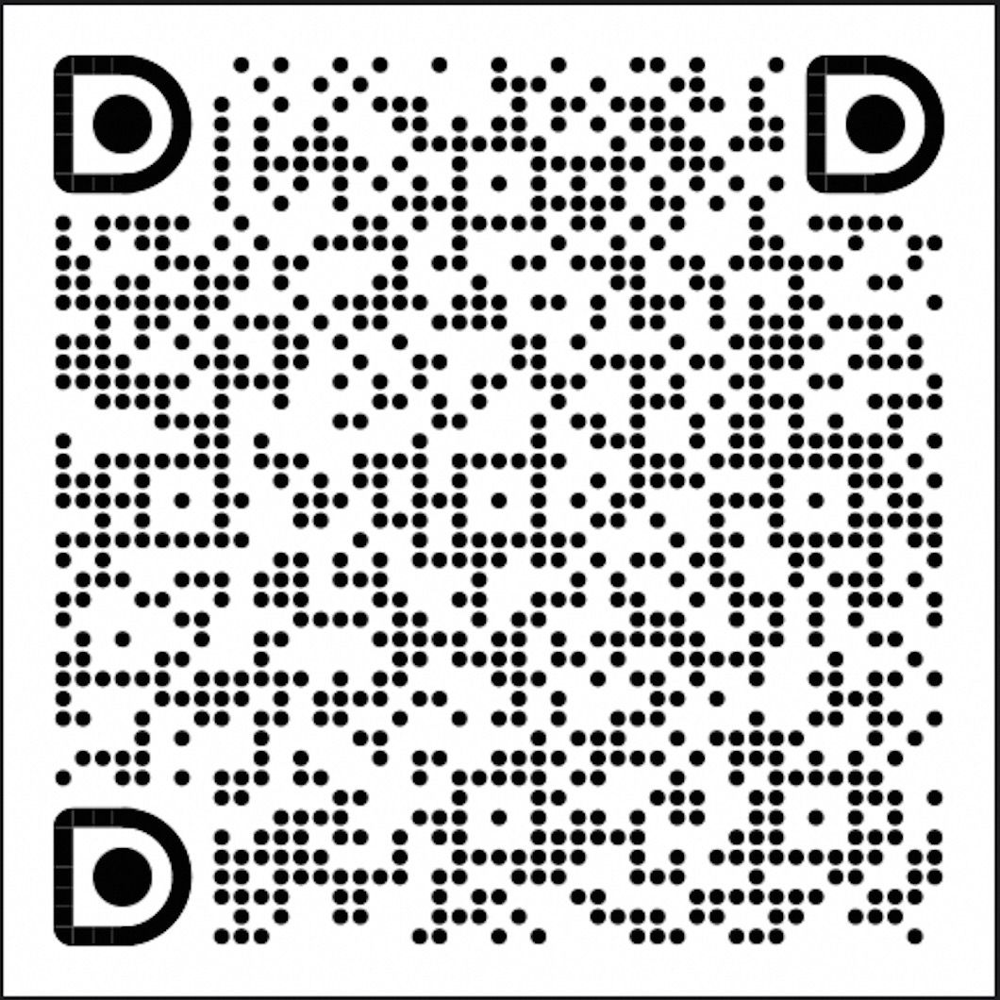

# SimCCL

SimCCL is an important component of [**SimAI**](https://github.com/aliyun/SimAI), which enables the transformation of collective communication operations into point-to-point communications. 

A basic version (files prefixed with mocknccl) is currently available in the [**astra-sim-alibabacloud**](https://github.com/aliyun/SimAI/tree/master/astra-sim-alibabacloud) repository.
The complete version will be separately included in this repository within the next two weeks.

Welcome to join the SimAI community chat groups, with the DingTalk group on the left and the WeChat group on the right.

    
    

 